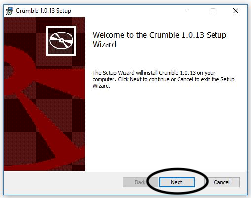

In a Google Chrome web browser window, navigate to the Crumble software download page [redfernelectronics.co.uk/crumble-software](https://redfernelectronics.co.uk/crumble-software/){:target="_blank"}.

Click on the **Windows MSI** link to download the software.

At the bottom left-hand of the page, in the file download tab, click on the upward arrow. Then click on **Open**.

An install dialogue window opens.

Click on **Next**.

Click on **Next**.

Click on **Install** to begin the installation process.

Your computer checks that you have permission to install software. If you do have permission, then click on **Yes**. If you do not have permission, ask for help from the computer's owner or perhaps the network administrator.

Finally, click on **Finish** to complete the installation process.

