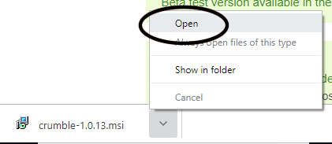
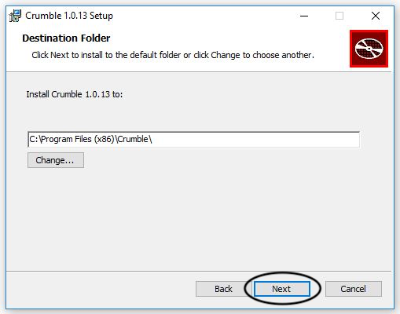
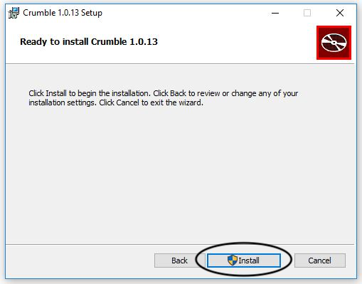

## Installing Crumble software on Windows OS

--- task ---

In a Google Chrome web browser window, navigate to the Crumble software download page, [https://redfernelectronics.co.uk/crumble-software/](https://redfernelectronics.co.uk/crumble-software/){:target="_blank"}.

Click on the Windows download MSI link.

At the bottom left of the page in the file download tab, click on the upward arrow and choose open.

An install dialogue box will open and you simply follow the instructions to complete the installation.

Continue or cancel? Click Next.

Accept the default install location. Click Next.

Begin install. Click Install.

User Account Control will check that you have permission. If you do, then click Yes. If you do not, you will need help from the device's owner or perhaps the network administrator.

Finally, click Finish to exit the installer.

--- /task ---